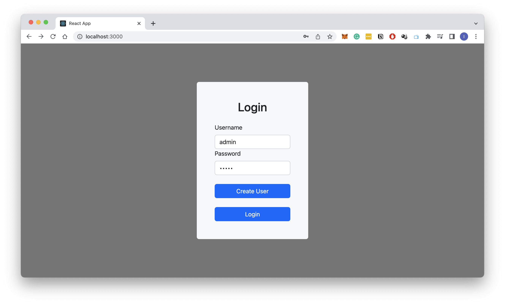
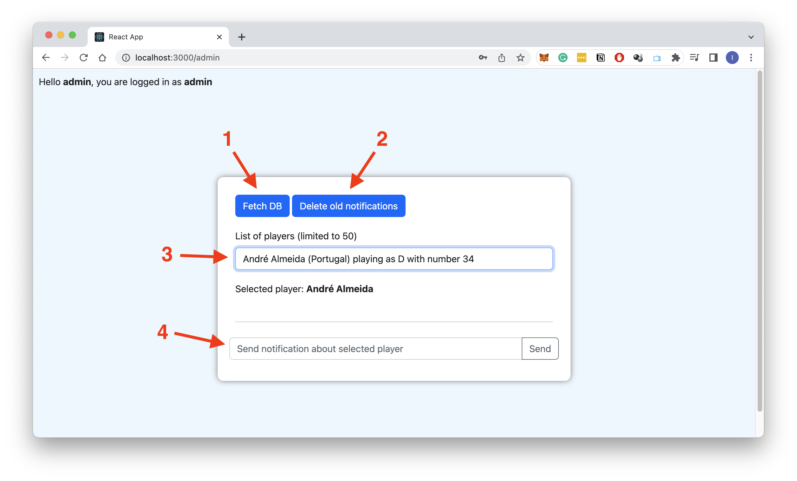
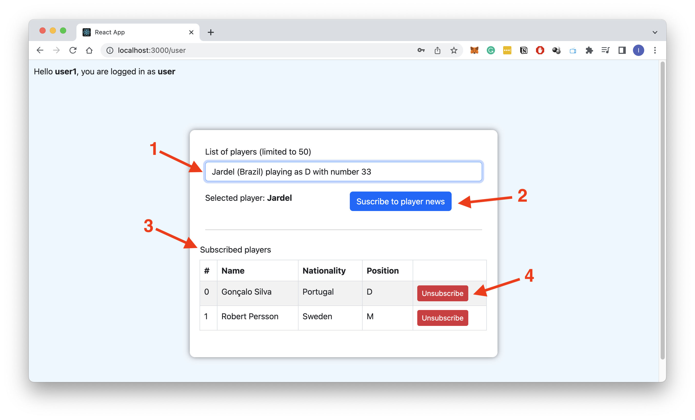
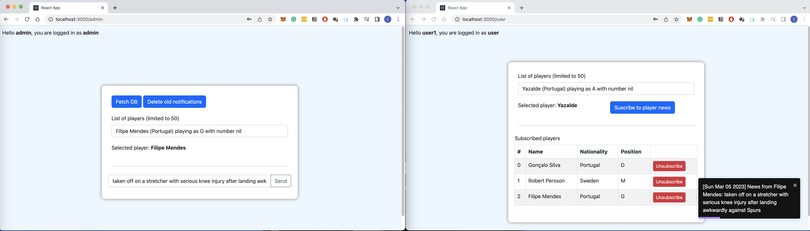

### How to run this?

- First you need to spin up the database. To do this run:
`>> cd mondodb`
`>> docker-compose up`
This will create a mongoDB container with a shared volume that will persist data so it won't be lost in case the container goes down.

- To run the backend run:
`>> cd backend`
`>> npm install`
`>> npm run compile`
`>> npm run start`
This will create a server running in localhost:3030 with a REST API serving the following endpoints:

In the folder `/backend/src/requests` there are examples of cURL request to the endpoints served by the backend. They are divided in 3 different routes:
(to test the endpoints it is needed to obtain a valid JWT using the request `/backend/src/requests/authenticate_user.http` passing the login/password of a valid user)

- Admin: `http://localhost:3030/admin/` This endpoint serves a PATCH method that can be used to perform administrative operations `{ "fetchData": true, "removeOldNotifs": true }`
    - fetchData: if true, it fetches the list of players from the github JSON server provided and populates the database with them
    - removeOldNotifs: if true, it removes the notifications which date is older than 1 week from database

- Users: `http://localhost:3030/users/` This endpoint handles CRUD of users of the application. Each user can have a role of 'admin' or 'user'.\
The file `backend/src/requests/post_user.http` shows an example of how to create a new user using cURL

- Players: `http://localhost:3030/players/`. This is the CRUD to handle the football players in the app

- Notifications: `http://localhost:3030/notifications/`. This is the CRUD that allows to persist the notifications. 
Every time an admin creates a notification it gets stored in database with a timestamp so it can be queried in the future.

- To run the frontend run:
`>> cd frontend`
`>> npm install`
`>> npm run start`
This will create a server running in localhost:3000 serving the react frontend app

## Walkthrough the app

Once all the services are up and running (db, backend and frontend), the main page allows you to create new users and login. The backend uses authentication via JWT token based on a local server. When you choose for a login and password and click on `Create User` a popup asks you the role of the user you want to create. After that, the user is activated and fully functional. Once the user is created we have 2 paths: being an `admin` or being an `user`.

#### Admin panel
Next screen shows the <b>Admin dashboard</b> that the user is redirected to in the case that they have an `admin` role assigned. Here are the main areas of that panel:
<ol>
<li>This button triggers an async request to the `/admin` endpoint to fetch data from github JSON to initialize the database. After this call a list of 50 players is returned to the frontend as an example.</li>
<li>This button removes from database all the notifications that are older than 1 week</li>
<li>The dropdown allows to select a specific player from the whole database. Once someone is selected, the admin can perform some operations like sending a notification about him.</li>
<li> The text area allows the admin to write a message about the <b>selected player</b> and click on `Send` to store it in database and to send it to every single user that is subscribed to that player.</li>
</ol>

#### User panel
This panel shows the <b>User dashboard</b> where the users can basically subscribe to receive notifications about the available football players.
<ol>
<li>This combobox displays all the possible football players registered</li>
<li>Once one player is selected, the user can click in subscribe and it will start listening notifications from that user</li>
<li>This is the panel with the current players that the user is subscribed to</li>
<li>Every player has a `Unsubscribe` button that allows to stop receiving notifications about him</li>
</ol>

#### Communication
This screen shows the communication process between admin and users, so whenever a new notification is raised by the admin it is sent <b>only</b> to the users subscribed to that scpecific player. Each notification lasts 10 seconds in the screen and is displayed in a toast.
